### Computer Vision Final Project

# Stereo Matching

National Taiwan University Spring 2026

## Introduction of Stereo Matching

- Q: How do human's eyes judge the distance between two objects or the depth of object?
- A: Two eyes perceive same object slightly differently and our brain can merge two images into a 3D image.
- That's Stereo Matching!!

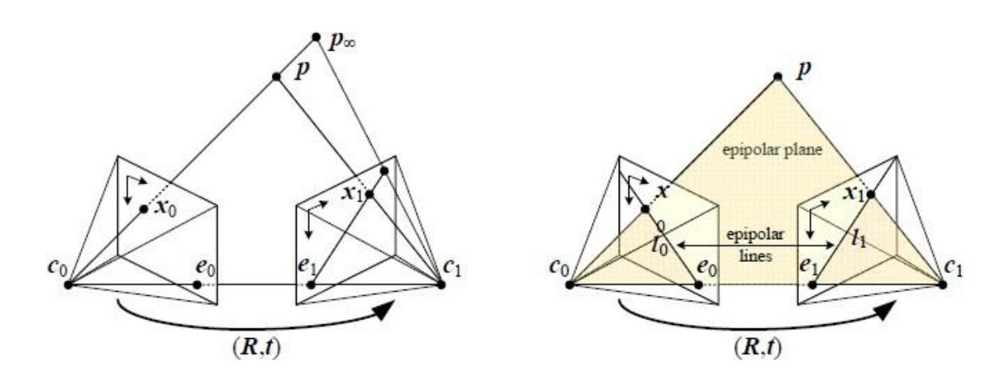

## Image Rectification

- Re-project image planes onto a common plane parallel to the line between optical centers.
- Pixel motion is horizontal after this transformation.

(The testing imagesin this assignment have been rectified.)

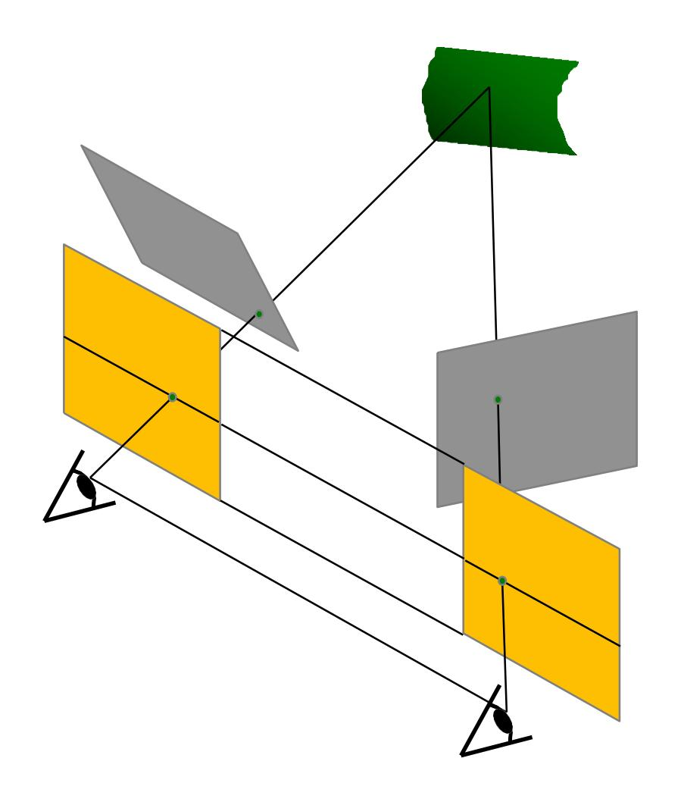

## Disparity Estimation

- After rectification, stereo matching becomes the disparity estimation problem.
- Disparity = horizontal displacement of corresponding points in the two images
  - Disparity of = −

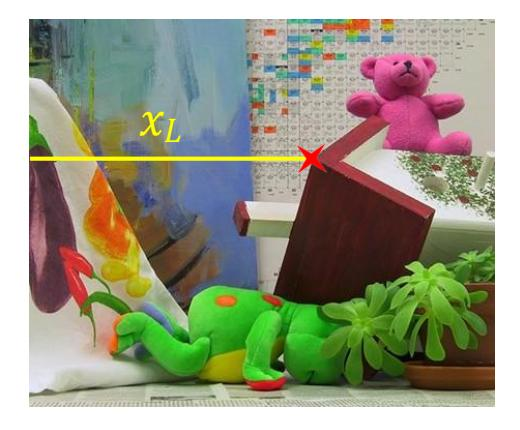

• You need to implement Disparity Estimation in hw4.

## Disparity Estimation

- "Hello world" algorithm: block matching
  - Consider SSD (Sum of Squared Distance) as matching cost

| 𝑑   | 0   | 1  | 2  | 3  | … | 33 | … | 59 | 60 |
|-----|-----|----|----|----|---|----|---|----|----|
| SSD | 100 | 90 | 88 | 88 | … | 12 | … | 77 | 85 |

Minimal cost [Winner take all (WTA)]

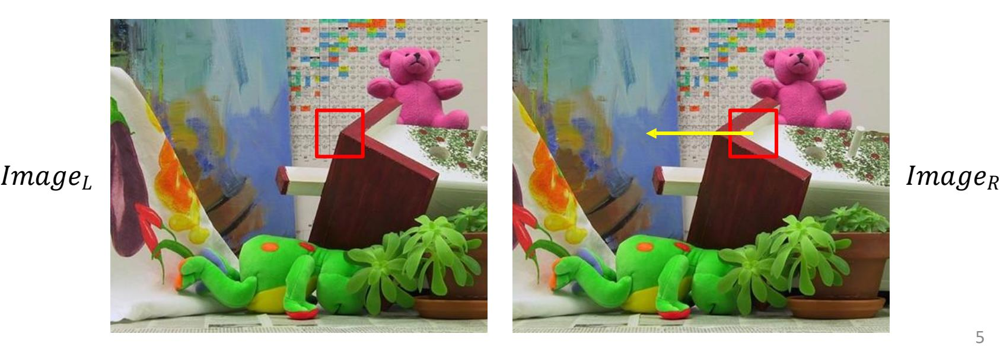

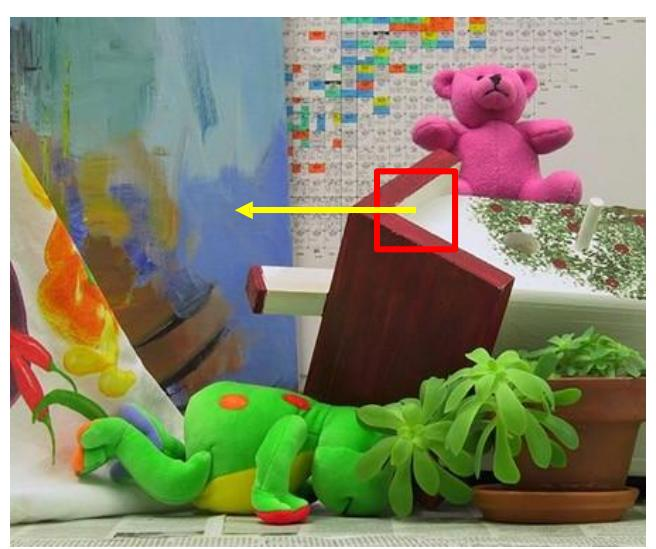

## Disparity Estimation

• Block matching result

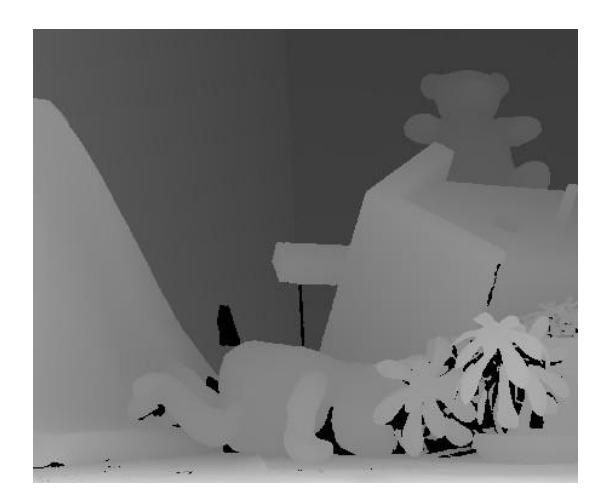

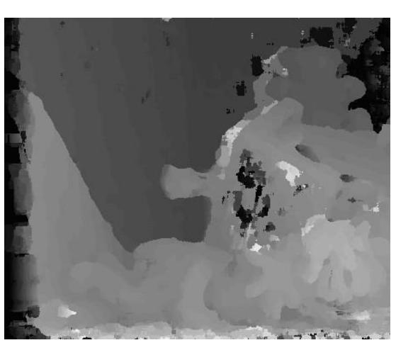

Ground-truth Window 5x5 After 3x3 median filter

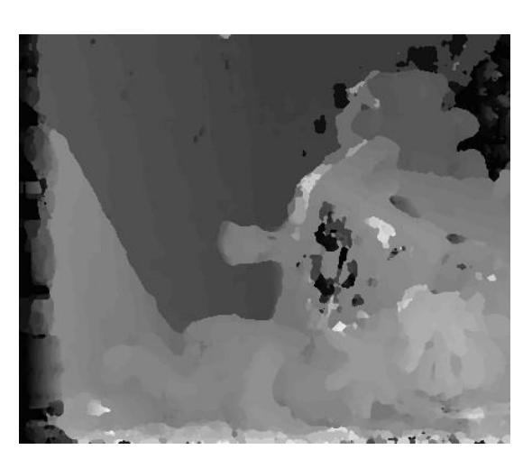

## Typical Improved Pipeline

- It consists of 4 steps:
  - Cost computation
  - Cost aggregation
  - Disparity optimization
  - Disparity refinement

## Step 1: Cost Computation

- Matching cost
  - Squared difference (SD): − 2
  - Absolute difference (AD): | − |
  - Census cost

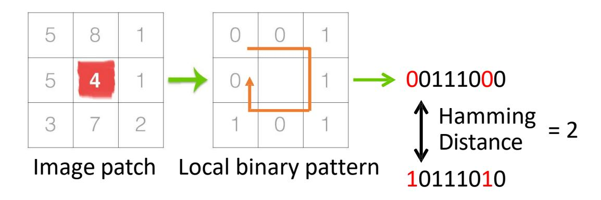

## Step 2: Cost Aggregation

• Illustration of the matching cost

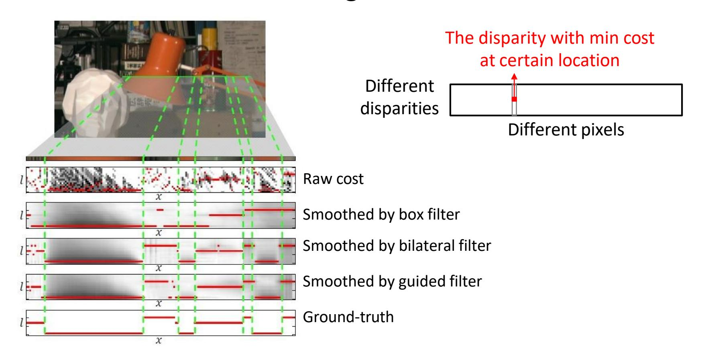

## Step 3: Disparity optimization

• Winner-take-all

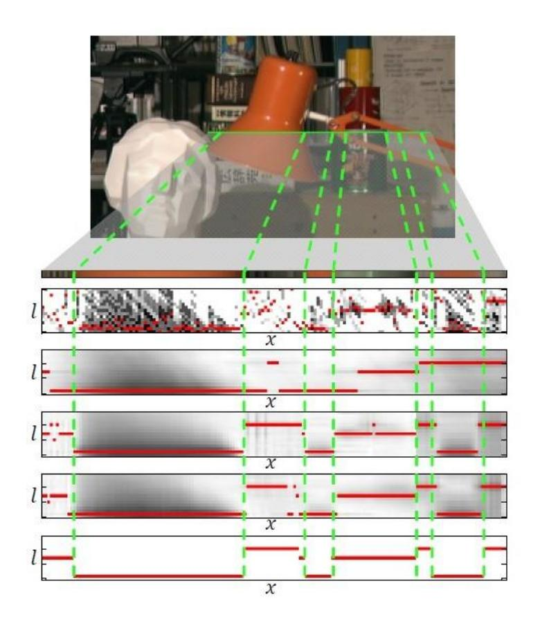

## Step 4: Disparity Refinement

- Left-right consistency check
  - Compute disparity map for left image
  - Compute disparity map for right image
  - Check if , = − , ,
    - If Yes, keep the computed disparity
    - If No, mark hole (invalid disparity)

*Note: are only used in this step!! Only need to keep for the next step.*

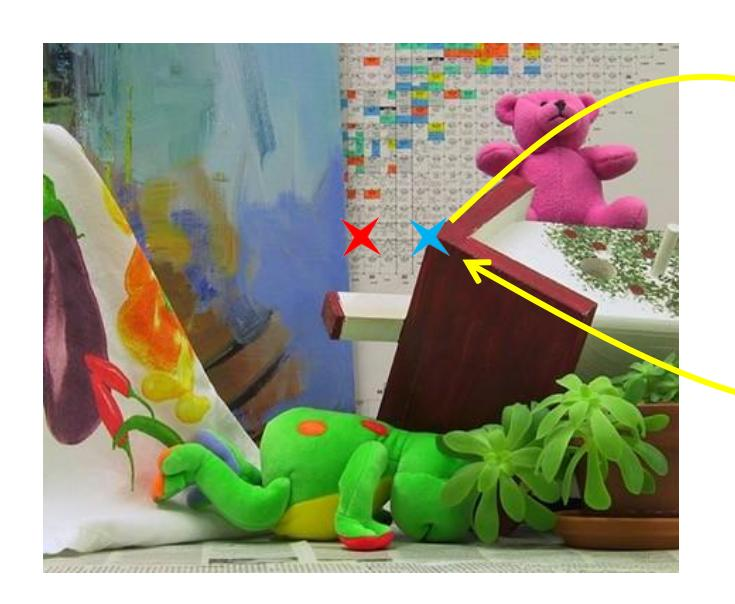

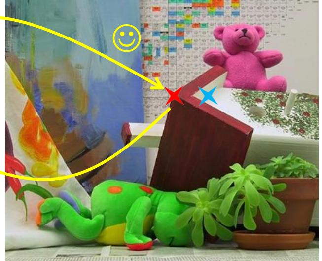

Two corresponding positions in images

## Step 4: Disparity Refinement

### • Hole filling

- , the disparity map filled by closest valid disparity from left
- , the disparity map filled by closest valid disparity from right
- Final filled disparity map = min(, ) (pixel-wise minimum)
- Tips: pad maximum for the holes in boundary (start point)

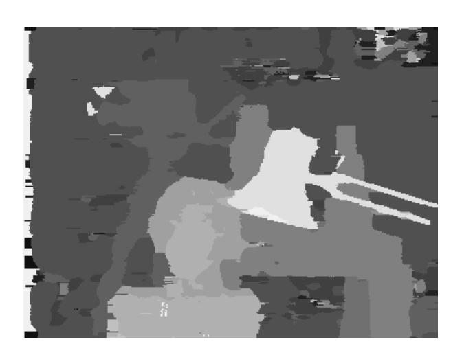

## Step 4: Disparity Refinement

• Weighted median filtering

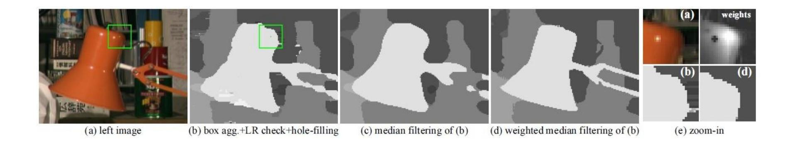

## Assignment Description(1/2)

• computeDisp.py (TODO)

#### Good News:

you CAN use cv2.ximgproc package with plenty of filtering operations

Maximum possible disparity (do not need to search the disparity larger than it)

You are not forced or limited to those tips. *But, they are good for you to improve your algorithm.*

CANNOT use deep learning based methods.

## Assignment Description(2/2)

- main.py (completed)
  - Read image, execute stereo matching, and visualize disparity map.
  - Usage: python3 main.py --image {input\_image}
- eval.py (DO NOT EDIT this file)
  - Compute disparity maps of the **left image** for the fourstandard test pairsfrom Middlebury v2

*Tsukuba Venus Teddy Cones* with gt without gt with gt without gt

• Evaluation metric: bad pixel ratio (error threshold = 1)

## Environment

- Python 3.6+
- Package
  - (optional)conda create –n <env name> python=3.6
  - pip3 install –r requirement.txt

## Bonus

- Core Objective
  - Leverage Stereo Matching algorithms to implement depth perception in real-world scenarios and practical applications.
- Technical Challenges
  - Develop and implement a complete technical pipeline, ranging from Image Rectification to Disparity Map Computation.
- Deliverables
  - The final submission must include the algorithm source code, a technical report, and a demonstration video showcasing the dynamic results.

## Submission(1/2)

- Directory architecture:
  - + R12345678\_final/
    - computeDisp.py
- Put all the files in a directory named StudentID\_final and compress the directory into zip file (named StudentID\_final.zip)
- After TAs run "unzip R12345678\_final.zip" , it should generate one directory named "R12345678\_final".
- Do NOT copy homeworks (including code and report) from others

## Submission(1/2)

- Please submit those two files, i.e. your StudentID\_final.zip and report.pptx, separately to NTU COOL
- Deadline: 6/5 11:59 pm
- Late submissions will not be accepted.

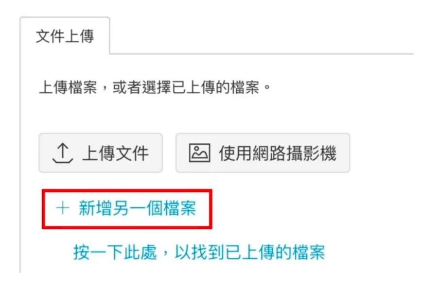

## Grading (Total 105%)

• Performance: 80%

(Each of the four images must satisfy its respective bad pixel ratio threshold.)

| Tsukuba | Venus | Teddy | Cones |
|---------|-------|-------|-------|
| <       | <     | <     | <     |
| 8       | 5     | 18    | 15    |

- Ranking: (ς=1 4 )\*
- A penalty of 30 points of the score will be deducted if the execution time for any image exceeds 10 minutes.
- A penalty of 20 points will be deducted if any of the four images fails to meet its respective bad pixel ratio threshold.

• Bouns: 25%

## TA information

• Fu-Sheng Yu(于富昇)

E-mail: fushengyu@media.ee.ntu.edu.tw